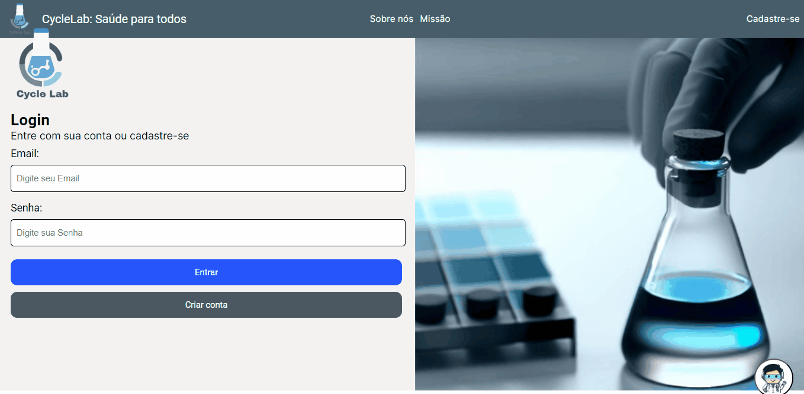

# CycleLab - Frontend

CycleLab Frontend é uma aplicação Angular que fornece uma interface de usuário responsiva para o sistema laboratorial interno CycleLab. Esta aplicação consome a API fornecida pelo backend em ASP.NET, que pode ser encontrada no repositório [CycleLab-Backend-ASP.NET](https://github.com/Vitto-Mazeto/CycleLab-Backend-ASP.NET). Durante o desenvolvimento, testei o uso exclusivo de imagens geradas pelo Bing Image Generator, e os resultados foram muito satisfatórios para o projeto, mostrando que a IA chegou para revolucionar.




## Funcionalidades Principais

- Autenticação de usuários utilizando tokens JWT.
- Utilização de auth.guard para a proteção das rotas
- Gerenciamento de usuários: criação, edição e exclusão de contas de usuário.
- Visualização e manipulação de amostras e exames.

## Pré-requisitos

- Node.js instalado na máquina.

## Instalação e Execução

Siga as etapas abaixo para configurar e executar o frontend do CycleLab:

1. Certifique-se de ter o Node.js instalado em sua máquina. Você pode fazer o download e a instalação do Node.js a partir do site oficial: [https://nodejs.org](https://nodejs.org).

2. Clone o repositório do CycleLab Frontend:

   ```shell
   git clone https://github.com/seu-usuario/CycleLab-Frontend-Angular.git
    ```
3. Acesse a pasta do projeto:
    ```shell
    cd CycleLab-Frontend-Angular
    ```
4. Instale as dependências do projeto:
    ```shell
    npm install
    ```
5. Inicie a Aplicação

## Contribuição
Contribuições são bem-vindas! Se você deseja contribuir para o projeto, siga as etapas abaixo:

1. Faça um fork do repositório.

2. Crie uma nova branch para a sua contribuição:

    ```shell
    git checkout -b minha-contribuicao
    ```
3. Faça as alterações necessárias e adicione, se necessário, imagens ou vídeos em uma pasta chamada docs na raiz do projeto.

4. Faça o commit das suas alterações:
    ```shell
    git commit -m "Minha contribuição"
    ```
5. Faça o push para o seu fork:
    ```shell
    git push origin minha-contribuicao
    ```
6. Abra um Pull Request para a branch principal deste repositório.


## Suporte
- Se você tiver alguma dúvida ou encontrar algum problema, sinta-se à vontade para abrir uma issue no repositório. Faremos o possível para ajudá-lo.

## Licença
- Este projeto está licenciado sob a MIT License.